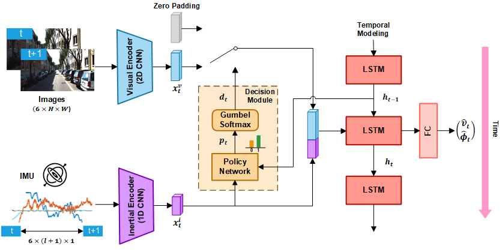
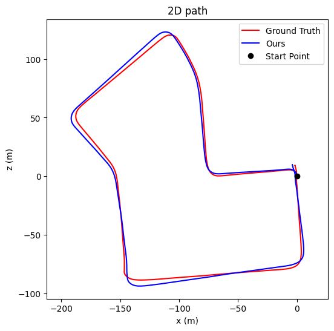
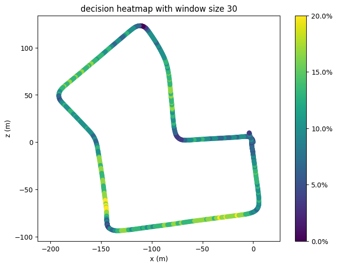
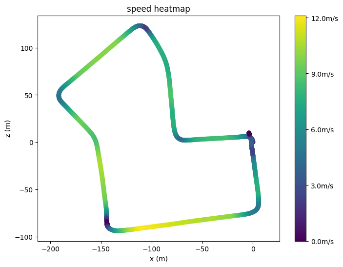

# Visual-Selective-VIO (ECCV 2022)

This repository contains the codes for [Efficient Deep Visual and Inertial Odometry with Adaptive Visual Modality Selection (ECCV '22)](https://arxiv.org/pdf/2205.06187.pdf). 

 

## Data Preparation

The code in this repository is tested on KITTI Odometry dataset. The IMU data after pre-processing is provided under `data/imus`. To download the images and poses, please run

      $cd data
      $source data_prep.sh 

## IMU data format

The IMU data has 6 dimentions: 

1. acceleration in x, i.e. in direction of vehicle front (m/s^2)
2. acceleration in y, i.e. in direction of vehicle left (m/s^2)
3. acceleration in z, i.e. in direction of vehicle top (m/s^2)
4. angular rate around x (rad/s)
5. angular rate around y (rad/s)
6. angular rate around z (rad/s)

## Download pretrainined models

We provide two pretrained checkpoints `vf_512_if_256_3e-05.model` and `vf_512_if_256_5e-05.model` and two pretrained FlowNet models in [Link](https://drive.google.com/drive/folders/1KrxpvUV9Bn5SwUlrDKe76T2dqF1ooZyk). Please download them and place them under `pretrain_models` directory.

## Test the pretrained model

Example command:

      python test.py --data_dir './data' --model './pretrain_models/vf_512_if_256_5e-05.model' --gpu_ids '0' --experiment_name 'pretrained'

The figures and error records will be generated under `./results/pretrained/files` The estimated path (left), speed heatmap (middle) and decision heatmap (right) for path 07 is shown below: 

  

## Reference

> Mingyu Yang, Yu Chen, Hun-Seok Kim, "Efficient Deep Visual and Inertial Odometry with Adaptive Visual Modality Selection"

    @article{yang2022efficient,
      title={Efficient Deep Visual and Inertial Odometry with Adaptive Visual Modality Selection},
      author={Yang, Mingyu and Chen, Yu and Kim, Hun-Seok},
      journal={arXiv preprint arXiv:2205.06187},
      year={2022}
    }
